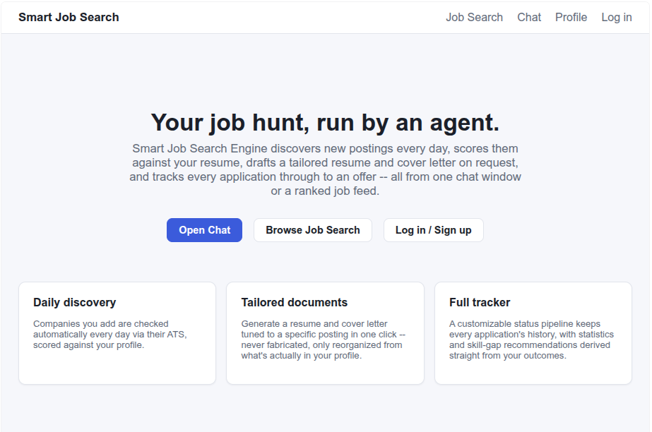

# Smart Job Search Engine

A multi-user, chat-driven AI system that hunts for jobs on your behalf: it finds new postings every day, scores them against your resume, drafts a tailored resume and cover letter on request, and tracks every application through to an offer — all from one chat window or a ranked job feed.

> Built in public, one phase at a time. See [Evolution](#evolution) for a running visual log and [Build Status](#build-status) for what's actually working right now.

---

## The Problem

Job hunting is tedious. You manually visit dozens of careers pages, copy-paste job descriptions, try to remember which resume you sent where, and lose track of who you've contacted for referrals. Most job boards show you irrelevant roles and there's no easy way to track everything in one place.

## The Solution

An AI agent system that does the heavy lifting:
- Checks your chosen companies' career pages automatically, every day, via their ATS APIs (Greenhouse/Lever) with a Playwright scraper fallback for everything else
- Scores every posting against your resume, excluding ones that fail your commute/remote preferences before they ever cost an LLM call
- Generates a tailored resume and cover letter per job on request, never fabricating experience that isn't in your real profile
- Tracks every application through a fully custom status pipeline, with full history so nothing gets lost when a status changes
- Learns from your feedback over time — rejections, reasons, and generated documents all feed back into a daily-refreshed "qualifications" summary, so matching actually improves the more you use it
- Emails you a reminder if you've liked a job but haven't applied yet

The primary interface is a chatbot — ask it to search, rate a job, tailor a resume, update your tracker, or explain why you keep getting rejected, and it calls the right tool itself.

---

## Architecture

```
React SPA (Netlify)                 FastAPI backend                     Data (per-user JSON + S3)
┌───────────────────┐   JWT auth   ┌────────────────────────┐          ┌─────────────────────────┐
│ Welcome             │────────────▶│ app/auth.py (+ 2FA)     │         │ storage/* — schemas,      │
│ Profile (5 tabs)    │◀──REST/SSE─▶│ chat/, tracker/ routers │────────▶│ JSON persistence, S3       │
│ Chat (+ sessions)   │             │ app/routes_*.py          │        │ files (resumes, docs)      │
│ Job Search          │             └───────────┬──────────────┘       └─────────────────────────┘
└───────────────────┘                           │ invokes
                                  ┌───────────────┼────────────────┬──────────────────┐
                                  ▼               ▼                ▼                  ▼
                        discovery_graph   tailoring_graph      chat_graph      qualifications/
                        (LangGraph)       (LangGraph)          (Gemini tool-   updater.py
                         ATS API/scraper   tailor + cover       calling loop    (self-improving
                         → geocode/filter  letter, parallel     over every      matching prompt,
                         → match scoring   fan-out               service)       folds in RAG +
                                                                                 rejection signal)
```

A background scheduler (APScheduler) runs the qualifications refresh, discovery, and email digest on a daily cron, independent of anything triggered live through chat.

---

## Tech Stack

| Layer | Technology |
|---|---|
| Backend | Python, FastAPI |
| Frontend | React, TypeScript, Vite |
| Orchestration | LangGraph (discovery, tailoring, and chat tool-calling graphs) |
| LLM | Google Gemini 2.5 Flash |
| Persistence | Per-user JSON files (SQLite migration planned later) |
| File storage | AWS S3 (resumes, generated documents) |
| Auth | JWT + TOTP two-factor authentication |
| Job discovery | Greenhouse/Lever ATS APIs, Playwright scraper fallback |
| Geocoding | OpenStreetMap Nominatim (commute/remote filtering) |
| Email | Resend (daily digest) |
| Scheduling | APScheduler |
| Frontend hosting | Netlify |
| Backend hosting | Not yet deployed — Hetzner VPS (EU region) recommended, see `docs/backend_hosting.md` |
| Retrieval (RAG) | In progress — custom-built by the project owner, see `rag/` |

---

## Project Structure

```
Smart-Job-Search-Engine/
├── app/                   # FastAPI entrypoint, auth (+2FA), profile/companies/jobs/documents/statistics routes
├── chat/                  # Chat session REST/SSE routes
├── orchestrator/          # LangGraph graphs (discovery, tailoring, chat), scheduler
├── scraper/                # ATS API clients (Greenhouse/Lever), Playwright fallback, discovery pipeline
├── geocoding/              # Commute-distance / remote-preference hard filter
├── resume/                 # PDF parsing, resume + cover letter generation (python-docx)
├── matching/                # Job ↔ profile scoring
├── tracker/                 # Application tracker (custom statuses, full status history)
├── stats/                   # Statistics + skill-gap analysis
├── qualifications/           # Self-improving matching-prompt synthesis
├── notifications/            # Email digest
├── rag/                     # Retrieval over profile + past documents — in progress, hand-built
├── storage/                  # Shared schemas + JSON persistence + S3 client (the single source of truth)
├── frontend/                 # React + Vite SPA (Welcome, Profile, Chat, Job Search)
├── docs/                    # Research docs (hosting, embeddings, EU job sources) + screenshots
├── data/                    # Per-user JSON data (gitignored)
├── docker-compose.yml
└── .env.example
```

---

## Getting Started

### Prerequisites
- Python 3.11+, Node 20+
- [Docker](https://www.docker.com/) (optional, for the full compose stack)
- A Google Gemini API key

### 1. Clone and configure
```bash
git clone https://github.com/MariMachaidze/Smart-Job-Search-Engine.git
cd Smart-Job-Search-Engine
cp .env.example .env
```
Fill in `.env` — see [Environment Variables](#environment-variables) below.

### 2. Backend
```bash
cd app && pip install -r requirements.txt
uvicorn app.main:app --reload --port 5000
```

### 3. Frontend
```bash
cd frontend && npm install
npm run dev
```
Without `VITE_API_BASE_URL` set, the frontend runs against mocked API responses automatically — useful for UI work without a live backend.

### 4. Or, the full stack via Docker
```bash
docker compose watch
```

---

## Environment Variables

| Variable | Purpose |
|---|---|
| `GEMINI_API_KEY` | Google Gemini API key — every LLM call in the system |
| `JWT_SECRET` | Signs auth tokens — generate with `python -c "import secrets; print(secrets.token_urlsafe(48))"` |
| `AWS_ACCESS_KEY_ID`, `AWS_SECRET_ACCESS_KEY`, `AWS_REGION`, `S3_BUCKET_NAME` | Resume/document file storage |
| `RESEND_API_KEY`, `DIGEST_FROM_EMAIL` | Daily "jobs you liked but haven't applied to" email |
| `VITE_API_BASE_URL` (frontend) | Real backend URL — unset defaults the frontend to mocked data |

---

## How It Works

```
Your companies list
    │
    ▼
discovery_graph ──► ATS API (Greenhouse/Lever) or Playwright scraper fallback
    │
    ▼
Geocode + hard filter ──► excludes jobs failing your commute/remote preferences
    │
    ▼
Score against your profile ──► uses the daily-refreshed qualifications summary once one exists
    │
    ▼
Chat or Job Search page ──► you rate relevant/not-relevant (with a reason), or request tailoring
    │
    ▼
tailoring_graph ──► tailored resume + cover letter, generated in parallel, never fabricated
    │
    ▼
Tracker ──► full application history, custom statuses
    │
    ▼
Statistics + skill-gap analysis ──► feeds back into tomorrow's qualifications refresh
```

---

## Evolution

A running visual log of how the app actually looks as it's built — add a new dated entry here each time the UI takes a meaningful step forward.

### 2026-10-10 — Welcome page live on Netlify


---

## Build Status

Built as 18 parallel workstreams, each independently live-tested as it landed (real API calls, real file I/O, real test suites — not just "looks done").

| Area | Status |
|---|---|
| Storage layer, auth + 2FA, job discovery, geocoding filter | ✅ Done, live-tested |
| Resume parsing, matching/scoring, document generation | ✅ Done, live-tested |
| Application tracker (+ status history), statistics + skill-gap | ✅ Done, live-tested |
| Qualifications updater, email digest, both LangGraph graphs, scheduler | ✅ Done, live-tested |
| API backend, chat orchestrator | ✅ Built — final wiring/live verification in progress |
| React frontend | ✅ Built, tests passing, deployed to Netlify — backend connection pending |
| RAG (`rag/`) | 🚧 In progress — hand-built by the project owner, see plan section 6a |
| Backend deployment | ⬜ Not yet deployed — frontend currently runs against mocked data |

See `docs/` for research backing specific decisions: `backend_hosting.md`, `embedding_options.md`, `eu_job_sources.md`.

## Roadmap (Post-MVP)

- [ ] Deploy backend (Hetzner VPS, EU region)
- [ ] Finish RAG implementation
- [ ] Additional job sources (Bundesagentur für Arbeit, Arbeitnow — see `docs/eu_job_sources.md`)
- [ ] SQLite migration once JSON-file persistence stops scaling
- [ ] Mobile-friendly frontend pass
